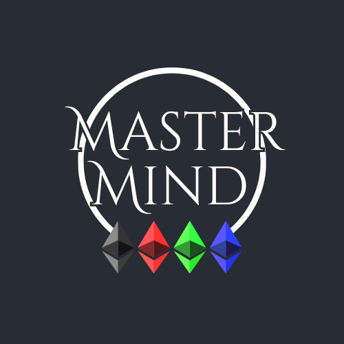

---
# MasterMind on Blockchain
This project is the implementation of the [Mastermind](https://en.wikipedia.org/wiki/Mastermind_(board_game)) game on the Ethereum Blockchain, exploiting the *hardhat* framework.

The DApp also provides a simple client to play (or simply test) the game, written in *React.js*.

The game is developed on a Smart Contract that provides all the facilities to play and handle a game with other people.

With respect to a _standard_ implementation of the game, a blockchain-based version:
- ensures that the secret code chosen by the _codemaker_ at the beginning of each turn is not modified later, before the CodeMaker discloses it;
- ensures that the feedbacks given by the CodeMaker to the CodeBreaker, at each turn, are consistent with the secret code chosen by the CodeMaker at the beginning of the game;
- allows to implement a rewarding mechanism for winning players;
- allows to define a penalty mechanism for cheating CodeMakers and for players that take no action at a particular turn, thus preventing the advancement of the game.

## Gameplay and rules
The game requires two players that have the roles of _CodeMaker_ and _CodeBreaker_. 

The Codemaker chooses a secret code, composed by N colors; At each turn, the codebreaker sends a guess: a sequence of N colors to which the codemaker will reply with a feedback composed by two numbers:
- The number of correct colors in the correct position;
- The number of correct colors in the wrong position.

The CodeBreaker continues guessing until they guess the code correctly or until they reach a maximum number of guesses.

At the end of each turn, the number of guesses that the CodeBreaker needed to crack the secret code is the number of points awarded to the other player, the CodeMaker. If the CodeBreaker does not end up breaking the code, K extra points are awarded to the CodeMaker.

## Blockchain-based version
### New Game
When the user creates a game, the smart contract returns a unique identifier ID of that game. The creator can create a *quick* game, that is a game opened to everyone, or a game with a designed player, specifying his/her Ethereum address. Then, when a player joins a game he/she can specify a game ID or can join a random *quick* game.

### Game Stake
At the start of the game, the two players agree (off-chain) on a common value of _Wei_ to be sent to the smart contract. This is called _game stake_. The total amount sent by the two players will be used to implement the rewardings and punishments.

This client implementation also provides a simple chat by means of which the players can agree on the stake.

### Secret Code
One of the two users is chosen at random by the smart contract as CodeMaker, and the other as CodeBreaker.  To guarantee that the secret chosen by the
CodeMaker is not modified later, the CodeMaker chosees the secret code and commits its **hash** on the blockchain.

### Guesses and Feedbacks
At each turn, the codebreaker sends a guess and the codemaker reply with a feedback. Each guess and feedback are registered in the smart contract.

At the end of each turn (either by reaching the number allowed number of wrong guesses or by correctly guessing the secret code before the limit), the CodeMaker reveals the secret code and the smart contract checks that its hash is equal to that committed at the beginning of the game. After the code is revealed, the CodeBreaker has a time period to possibly **dispute** any feedback returned by the CodeMaker, sending a reference to the guesses they
are disputing. 

The smart contract decides if the CodeMaker has (unintentionally or maliciously) cheated, by giving a wrong feedback, or if the CodeBreaker has unjustly accused
the other player. The player who attempted to cheat is **punished** by sending the game stake to the opponent.

After the dispute time period, if no notification is received from the CodeBreaker, the smart contract computes
the points earned by the CodeMaker and starts a new turn, switching the player roles.

### AFK
At any point, a player A may accuse the other player P of *away from keyboard*. P may react within a certain timeframe, by performing the action required by that phase of the game. If P does not properly react within that time period, it is
**punished** by sending all the game stake to A, and the game is over.

### Number of turns
In this implementation, there are 4 turns, so each player plays for the same number of turn the role of both codemaker and codebreaker. Each turn is composed by 8 guesses and feedbacks. AFK and Dispute time are both of 36 seconds, that is a multiple of 12: the ethereum average block time.

## Requirements and Usage
The client mainly requires *Node.js*. 
You can install the dependencies via `npm install`.

Then you can run a client via scripts:
- `npm run start` to run two clients and the chat server, in order to fully test the application.
- `npm run start:client` just run a client, and `npm run start:chat` just run the chat server. In future, the chat server will be hosted in a remote server.
- `npm run start:test` run a set of automatic test.
- `npm run start:coverage` shows the test coverage.
- `npm run start:gas` computes an estimation of the gas consumed by the application, by means of the package `hardhat-gas-reporter`.

## Demo
<video width="500" height="300" controls>
  <source src="./Demo.mp4" type="video/mp4">
</video>

## Future Works
- Host the chat server in a remote machine;
- Punished users will be black-listed;
- An ad-hoc minimization of the gas;
- Better renderization of the front-end;
